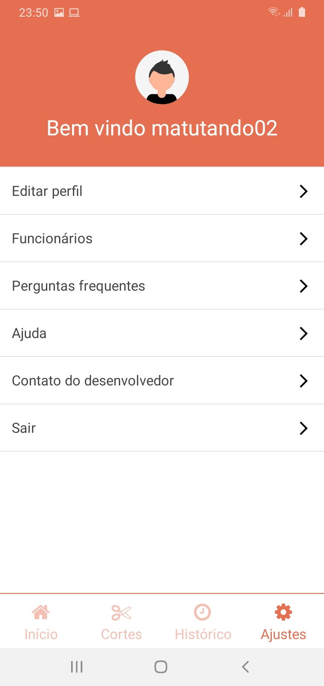
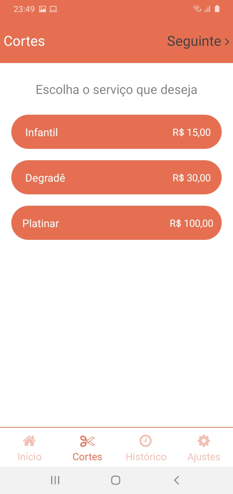
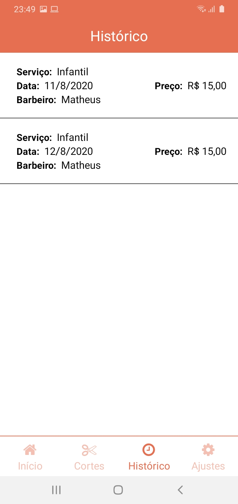
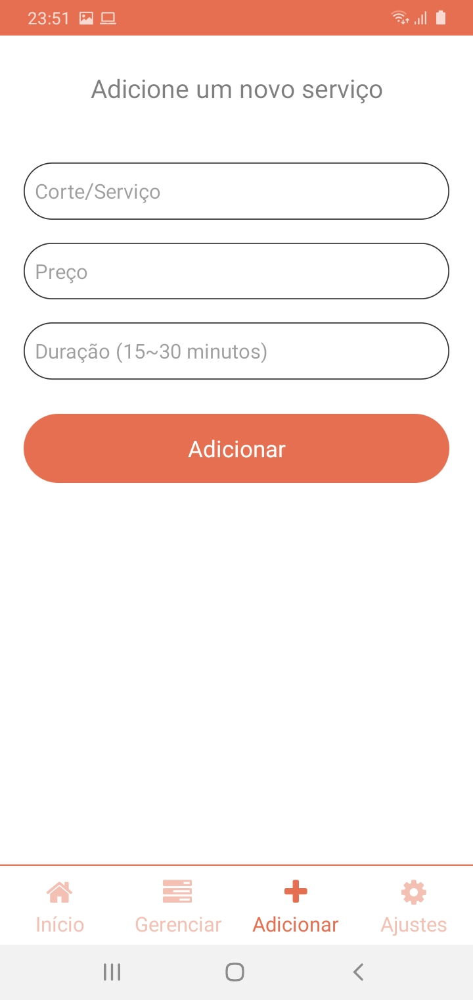
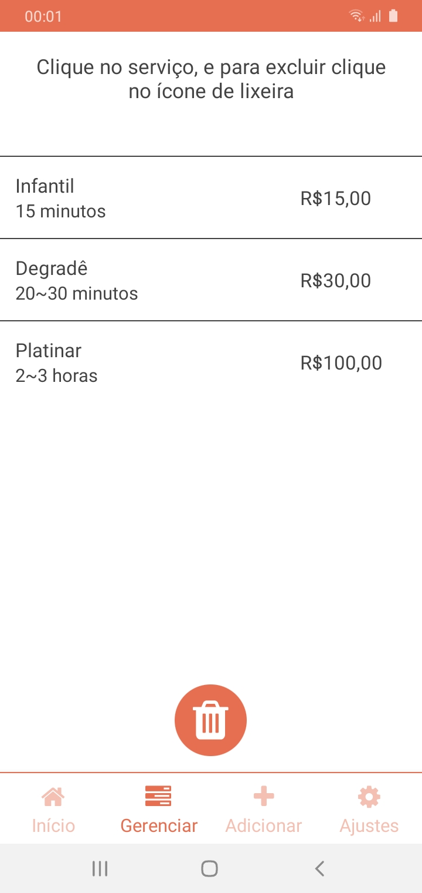

## BarberMen

  - Um projeto feito para fins de experiência. O objetivo foi criar um App para uma barbearia (fictícia) com algumas funções para que o usuário possa agendar o corte, dia e horário que ele prefere ser atendido, também mostrando o histórico dos cortes que o usuário já marcou pelo App e com uma sessão para que o usuário deixe seu comentário sobre a barbearia. Também tem a sessão de Admin que permite que o mesmo cadastre novos cortes, e gerencio-os, podendo excluí-los.
  
## Exemplo de uso

  ### Usuário comum
    
  Tela Inicial, onde o usuário pode realizar o login e cadastro, e mais abaixo deixar seu comentário sobre a barbearia
   
   
  
  Aqui o usuário consegue realizar o login, caso já seja cadastrado
   
   
  
  Tela de configurações
   
   
  
  Aqui o usuário pode escolher o corte que deseja fazer, depois o dia, depois o horário e finalizar
   
   
  
  Histórico de agendamento do usuário
   
   
  
  ### Admin
  
  O Admin pode cadastrar novos cortes/serviços aqui
   
   
  
  Aqui pode ser feito a exclusão dos cortes/serviços, apenas por um Admin
 
  
  
