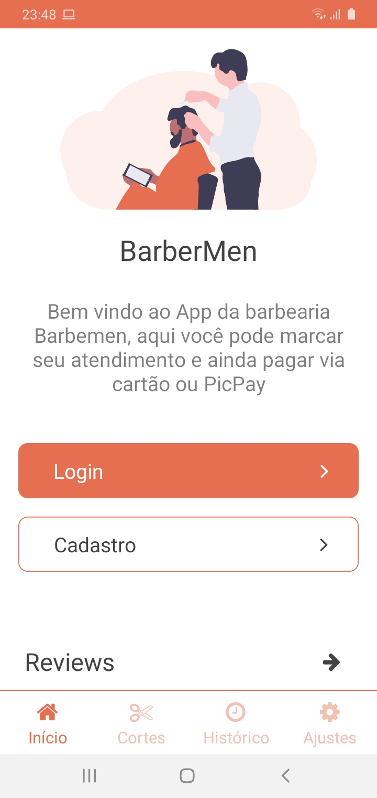
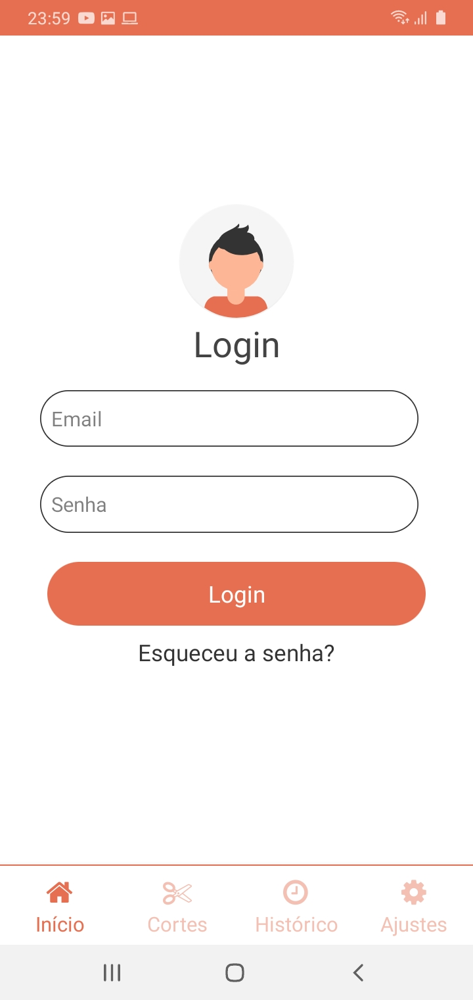

## BarberMen

  - Um projeto feito para fins de experiência. O objetivo foi criar um App para uma barbearia (fictícia) com algumas funções para que o usuário possa agendar o corte, dia e horário que ele prefere ser atendido, também mostrando o histórico dos cortes que o usuário já marcou pelo App e com uma sessão para que o usuário deixe seu comentário sobre a barbearia. Também tem a sessão de Admin que permite que o mesmo cadastre novos cortes, e gerencio-os, podendo excluí-los.
  
## Exemplo de uso

  ### Usuário comum
  
  
    
  Tela Inicial, onde o usuário pode realizar o login e cadastro, e mais abaixo deixar seu comentário sobre a barbearia
	

  
  Aqui o usuário consegue realizar o login, caso já seja cadastrado
 
  
  
